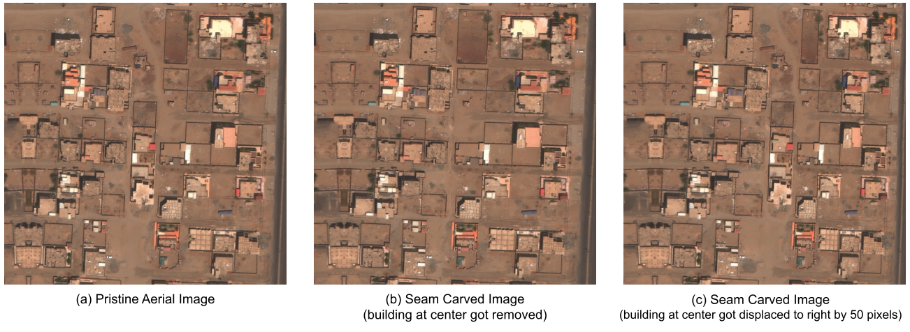
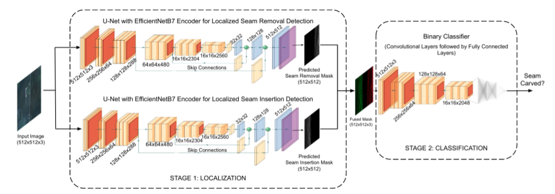

# SeeTheSeams
Localized Detection of Seam Carving based Image Forgery

## Introduction

Seam carving is a popular technique for content aware image retargeting. It can be used to deliberately manipulate images, for example, change the GPS locations of a building or insert/remove roads in a satellite image. This work presents a novel approach for detecting and localizing seams in such images. While there are methods to detect seam carving based manipulations, this is the first time that robust localization and detection of seam carving forgery has been made possible. We also propose a seam localization score (SLS) metric to evaluate the effectiveness of localization. The proposed method is evaluated extensively on a large collection of images from different sources, demonstrating a high level of detection and localization performance across these datasets. 

## Seam Carving Forgery

Seam carving is a popular image manipulation technique that is  effective for content aware image retargetting. In seam carving, the input image is resized by removing or inserting _seams_ which are defined as connected pixel paths from top-to-bottom or left-to-right. These seams are chosen by their optimality according to an energy function computed for each pixel. That is, the optimal seam is the seam with the lowest energy along its path. Commonly used energy functions in seam carving are computed by measuring the contrast of a pixel with its neighbors. Removing an optimal seam has fewer artifacts in resized images than a randomly chosen seam, and protects image content that is highly textured. Seam carving can be extended to remove entire objects from images by assigning the energy of object pixels to a low value such that the seams forcibly pass through the object marked for removal. Seam carving can also be used to displace an object in a given image by forcing the algorithm to remove seams from one side of the object and insert seams on the other side. Since seam carving leaves a large percentage of pixel values untampered, it poses a challenge to image forgery detection.



## Seam Carving Forensics

We propose a two stage, deep learning based seam carving detector with two key advantages over existing methods. The first advantage is the ability to _localize the seams_ at pixel level resolution. This is invaluable in discovering the extent of potential manipulations in satellite imagery. By considering the location of seams, one may be able to discover not only that an object may have been removed in an image, but where that removed object used to be. The second advantage is _generalizability_. Since image level classifiers are trained on original satellite images, they are prone to become specialized to the distribution of data they are trained on. We observed that our method is generalizable to not only training dataset distribution but different seam carving techniques.



## Dataset

```diff
+ DATASET CAN BE REQUESTED FOR DOWNLOAD
- CODE IS NOT MADE AVAILABLE AT THIS TIME
```

### Download Policy

We are not responsible, or liable to you or any third party, for the content or accuracy of any materials provided by us. The release of data is conditioned on accepting the following terms to avoid the dataset being misused.

- If you are a student (or postdoc) in academia, please ask your advisor (or host) to fill out the [form](https://mayachitra.com/#contact-us) with subject that starts with [SeeTheSeams Dataset Request]. If you are a faculty member, please provide university's email account in the form. In your message, please include your name, affiliation, and homepage. The information is needed for verification purpose.
- If you are in research (industrial) labs, please fill out the [form](https://mayachitra.com/#contact-us) by providing your company's email account with subject that starts with [SeeTheSeams Dataset Request]. In the message, please briefly introduce yourself (e.g., name and title) and your company. In the form, please attach a justification letter (in PDF format) in official letterhead. Please state clearly the reasons why the dataset is being requested, in the justification letter.

Please note that, your request will be ignored if you are unable to follow these conditions. Also, while filling out the form, please make sure that the **message's character length is between 20 and 1000**, and/or the **PDF attachment is less than 2MB**.

## Citing

If you wish to refer to the content published here, please use the following BibTeX entry to cite our [paper](https://arxiv.org/abs/2108.12534):

```bibtex
@InProceedings{Gudavalli_2022_CVPR,
    author    = {Gudavalli, Chandrakanth and Rosten, Erik and Nataraj, Lakshmanan and Chandrasekaran, Shivkumar and Manjunath, B. S.},
    title     = {SeeTheSeams: Localized Detection of Seam Carving Based Image Forgery in Satellite Imagery},
    booktitle = {Proceedings of the IEEE/CVF Conference on Computer Vision and Pattern Recognition (CVPR) Workshops},
    month     = {June},
    year      = {2022},
    pages     = {1-11}
}
```

## Related Works

Please feel free to also check out our other related published works:

- [Seam Carving Detection and Localization using Two-Stage Deep Neural Networks (2021)](https://link.springer.com/chapter/10.1007/978-981-16-0289-4_29)
- [Holistic Image Manipulation Detection using Pixel Co-occurrence Matrices (2021)](https://arxiv.org/abs/2104.05693)
- [Detecting GAN generated Fake Images using Co-occurrence Matrices (2019)](https://arxiv.org/abs/1903.06836)
- [Hybrid LSTM and Encoder-Decoder Architecture for Detection of Image Forgeries (2019)](https://arxiv.org/abs/1903.02495)
- [Deep Learning Methods for Event Verification and Image Repurposing Detection (2019)](https://arxiv.org/abs/1902.04038)


## Contact Us

Mayachitra, Inc. <br />
5266 Hollister Ave, Suite 229, Santa Barbara, CA, 93111 <br />

Have more questions? Write to us by filling in this [form](https://mayachitra.com/#contact-us).

## License

All the above material is released under GPL-3.0 License.

Copyright © 2022 [Mayachitra, Inc.](https://mayachitra.com/)
